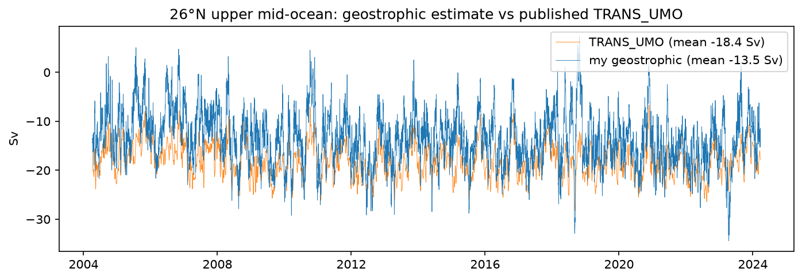
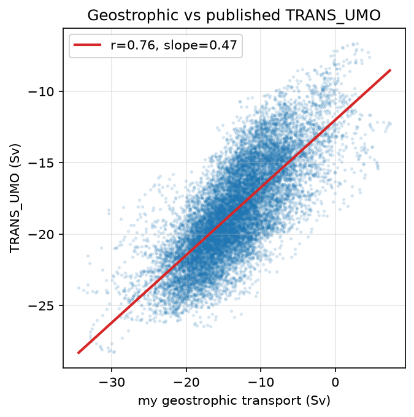
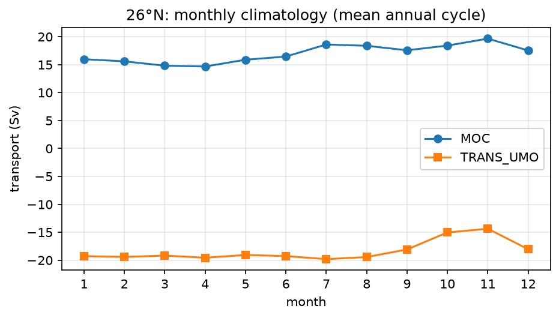
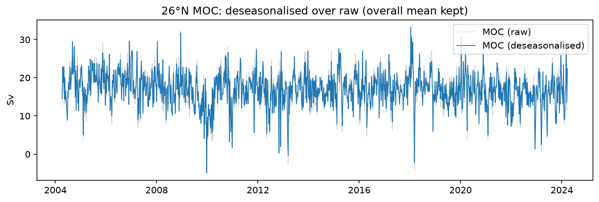
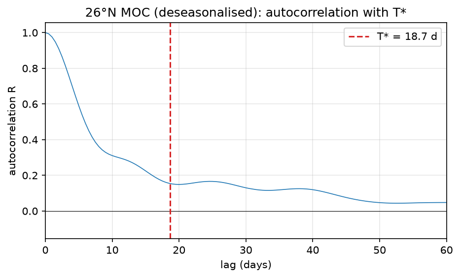
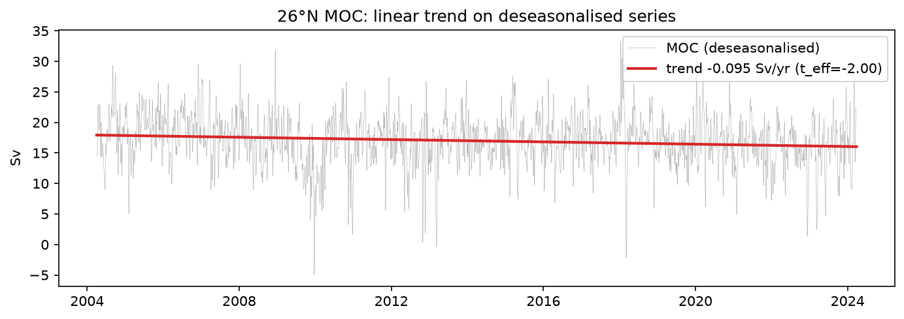
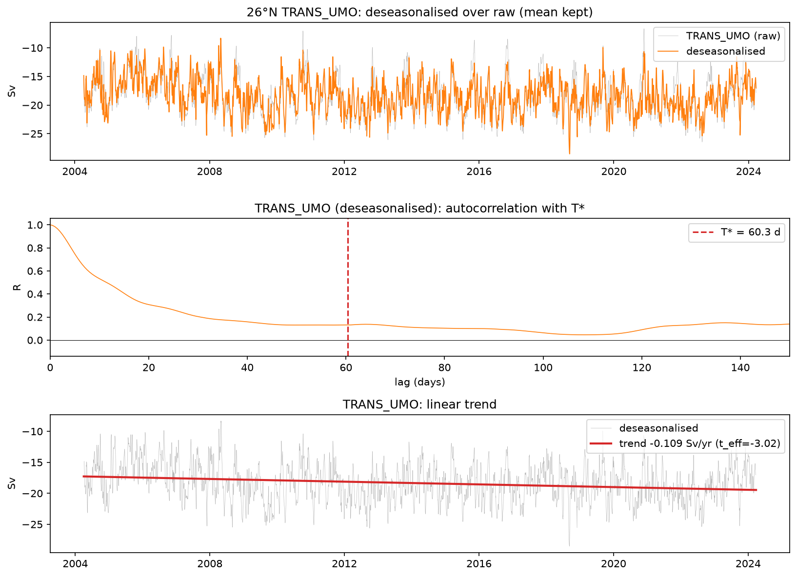
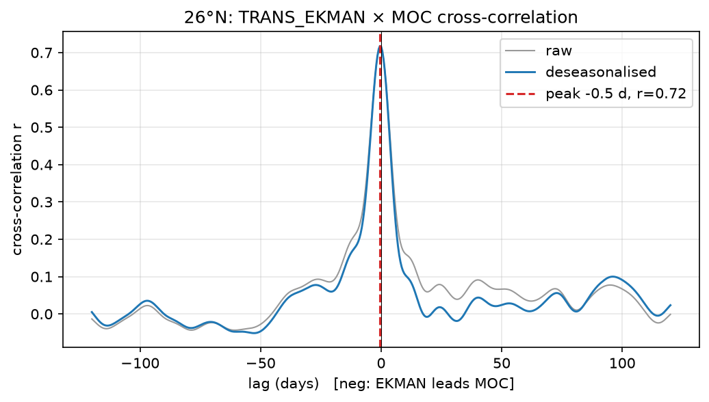
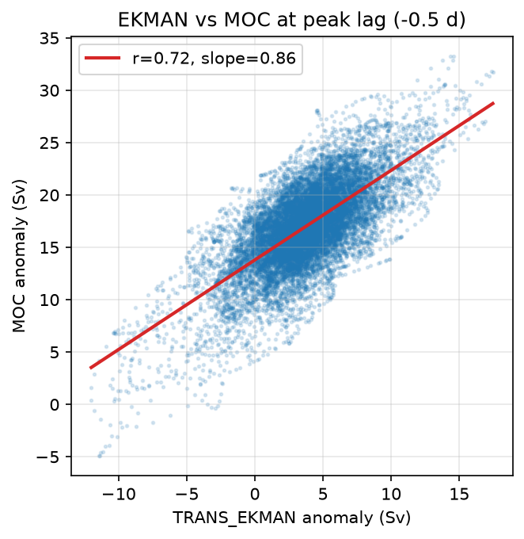
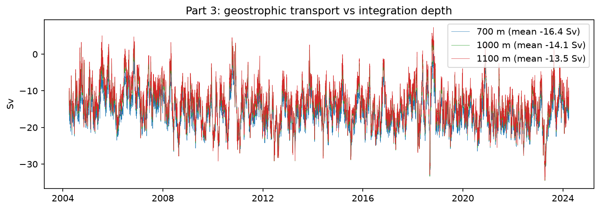

# Assignment 2 — Geostrophic transport and relating AMOC series

Gideon Akinlotan · Data Analysis for Physical Oceanography (MSc) · Summer 2026
Repository: https://github.com/Gizzhy/amoc-correlation-trends

All series are from the RAPID 26°N array via the AMOCatlas package, on a 12-hourly
`TIME` grid spanning 2004-04 to 2024-03 (14,599 points). Part 1 additionally uses the
RAPID boundary hydrography (`ts_gridded.nc`). Missing values (~20 timesteps per
transport series) are dropped pairwise before each comparison.

## Part 1 — Geostrophic transport vs TRANS_UMO

I compute the upper mid-ocean geostrophic transport at 26°N from the RAPID boundary
hydrography (`ts_gridded`): converting the western and eastern boundary T/S profiles
to TEOS-10, forming the dynamic height at each boundary referenced to 4820 dbar,
differencing them for the zonally-integrated thermal-wind transport per unit depth,
and integrating from the surface to **1100 m** — the depth of the AMOC maximum. I
integrate only to 1100 m rather than the full water column because the *upper*
mid-ocean transport is defined as the northward/southward interior flow above the
overturning maximum; extending the integral deeper would fold in the southward NADW
and the deep return limbs, giving the full-depth interior transport rather than the
upper-ocean cell that balances the Gulf Stream and Ekman inflow.

Compared with RAPID's published `TRANS_UMO` over the common 2004–2024 record
(14,579 paired points), my estimate correlates at r = 0.76 (r² ≈ 0.58) and tracks
its variability in phase (Figure 1), but differs in two systematic ways. First, a
mean offset: my transport averages −13.5 Sv against the published −18.4 Sv, i.e. ~5
Sv less southward. This is expected — the official product additionally splits the
interior at the Mid-Atlantic Ridge and applies a basin-wide mass-balance
(external-transport) adjustment, neither of which my single east–west baroclinic
estimate includes, and both of which shift the mean. Second, my estimate carries
more variance (std 5.5 Sv vs 3.4 Sv): the mass-balance adjustment in the published
product removes a barotropic/external component that my baroclinic-only calculation
retains as extra scatter. This shows directly in the scatter (Figure 2), where the
regression slope is 0.47 rather than 1 — a unit change in my noisier estimate maps
to about half a unit in the smoother published series. So the thermal-wind
calculation recovers the sign, the timing, and the bulk of the interior transport
variability, with the residual differences attributable to the interior partition
and mass-balance steps that the operational product adds.

## Part 2A — Seasonal cycle and trend

**26°N MOC.** The overturning transport (2004-04 to 2024-03, 14,579 twelve-hourly
samples, mean 17.0 Sv) has a clear but modest seasonal cycle, weakest in spring
(~15 Sv, Mar–Apr) and strongest in autumn (~19–20 Sv, Oct–Nov; Figure 3). Removing
the monthly climatology (with the overall mean retained) lowers the variance only
from 19.4 to 17.0 Sv², i.e. the seasonal cycle accounts for ~12% of the total
variability — at 26°N the MOC is dominated by non-seasonal fluctuations (Figure 4).
The deseasonalised anomalies decorrelate on an integral timescale T* ≈ 18.7 days
(Figure 5), so although the record holds N = 14,579 points it carries only
N_eff ≈ 220 effectively independent samples. A linear fit gives a weakening trend of
−0.095 Sv/yr (≈ −1.9 Sv over the record; Figure 6). Judged naively this looks
overwhelmingly significant (slope/SE = −16, p ≈ 10⁻⁵⁸), but that ignores the strong
persistence of the series; inflating the standard error for autocorrelation
(SE 0.006 → 0.047 Sv/yr) gives slope/SE = −2.0 and p_eff = 0.047. The trend is
therefore only *marginally* significant at 95% — it sits right at the threshold, and
a modestly different timescale estimate could move it either side of it. The honest
reading is a suggestive weakening of the 26°N MOC rather than a firmly established
one, and it illustrates how using the raw sample size (p ≈ 10⁻⁵⁸) would grossly
overstate the confidence.

**26°N TRANS_UMO.** The upper mid-ocean (interior geostrophic) transport is a
southward return flow (mean ≈ −19 Sv) whose seasonal cycle is proportionally larger
than the MOC's: removing the monthly climatology cuts the variance from 11.7 to
8.7 Sv² (~26% seasonal, versus ~12% for the MOC). Its anomalies are also far more
persistent, with an integral timescale T* ≈ 60 days, so the 14,579-point record
again collapses to only N_eff ≈ 190 independent samples. The linear trend is
−0.109 Sv/yr (a strengthening of the southward interior flow of ≈ −2.2 Sv over the
record). Despite the stiffer autocorrelation penalty — the longer T* inflates the
standard error more than for the MOC — the trend remains clearly significant:
slope/SE = −3.0 with p_eff = 0.003, well inside 95% (Figure 7). So both components
weaken over 2004–2024, but the upper mid-ocean transport carries the more
statistically robust trend, which is physically consistent with the interior
geostrophic flow being a major contributor to the observed decline of the 26°N
overturning.

## Part 2B — Cross-correlation and lead/lag: TRANS_EKMAN vs MOC

I compare the wind-driven Ekman transport with the total overturning at 26°N. Both
come from the same RAPID 12-hourly product on the same TIME axis and are identically
processed, so no matched pre-filtering is required (the pitfall of correlating series
with different filtering does not arise here); I align them on TIME and drop the ~20
timesteps where either is missing, leaving 14,579 paired points (2004–2024). Because
two series that share an annual cycle correlate spuriously at ±12 months, I remove
the monthly climatology from each before cross-correlating, and show both the raw and
deseasonalised cross-correlations (Figure 8).

The cross-correlation is a single sharp peak of r ≈ 0.72 (r² ≈ 0.52) centred on zero
lag — the deseasonalised peak (0.718) is essentially identical to the raw one
(0.712), confirming the relationship is not a seasonal artefact. Under the sign
convention that a negative lag means Ekman leads MOC, the peak sits at −0.5 days,
i.e. within a single 12-hourly sample of zero: the two are effectively simultaneous,
and I do not read the half-day offset as a physical lead. This is expected — Ekman
transport is a near-instantaneous barotropic response to wind stress and is itself an
additive component of the MOC, so the two co-vary in phase; the regression slope of
0.86 Sv per Sv (Figure 9) reflects that near-direct contribution.

On significance: the series are persistent (integral timescales T* ≈ 7 days for Ekman
and ≈ 19 days for MOC), so the 14,579-point record carries only N_eff ≈ 195
independent samples. Even on that honest sample size the correlation is
overwhelmingly significant (t ≈ 14, p ≈ 10⁻³²): Ekman variability explains about half
the variance of the 26°N overturning, and the relationship is robust rather than an
artefact of oversampling. This contrasts instructively with the MOC trend of Part 2A,
which — judged by the same effective-sample-size method — was only marginally
significant; a large r with few independent samples can still be highly significant
when r is this strong, whereas a small slope with the same N_eff sits at the edge.

## Part 3 — Depth sensitivity of the geostrophic transport

To test how much the Part 1 result depends on a choice I made rather than on the
data, I recompute the geostrophic transport integrating to three upper limits — 700,
1000 and 1100 m — and compare each with the published `TRANS_UMO` (Figure 10). The
question is whether the integration depth is a free knob that could be tuned to
improve the match, or a physically fixed choice.

The mean transport becomes *less* southward as the limit deepens (−16.4 Sv at 700 m,
−14.1 at 1000 m, −13.5 at 1100 m), while its variance grows (std 4.4 → 5.5 Sv). The
deeper layers therefore add a *northward* increment to the interior transport,
consistent with the northward Antarctic Intermediate Water present around
800–1100 m — which is precisely why RAPID integrates the upper mid-ocean transport
down to the depth of the AMOC maximum (~1100 m) rather than a shallower level.
Counter-intuitively, the correlation with `TRANS_UMO` is slightly *higher* at 700 m
(r = 0.787) than at 1100 m (r = 0.763), and the shallow estimate is also smoother. So
the metric and the physics disagree: I could raise the correlation by stopping at
700 m, but that would be tuning the depth to the answer. The defensible choice is
1100 m, because that is how the published product is defined — matching the AMOC
maximum and including the northward AAIW layer. The exercise shows the sensitivity is
real (a 3 Sv spread in the mean across 400 m of integration depth) but that the
correct depth is set by the physics of the overturning cell, not by whichever value
best reproduces the target series.

